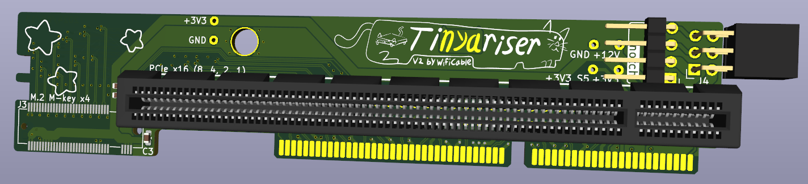
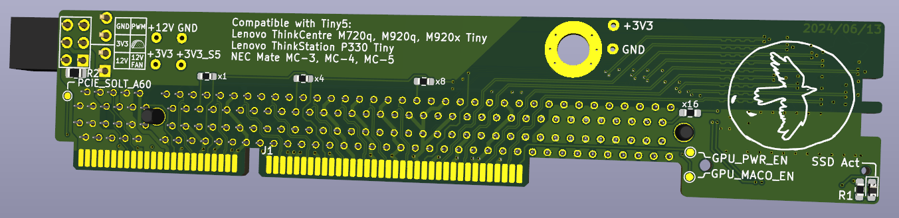
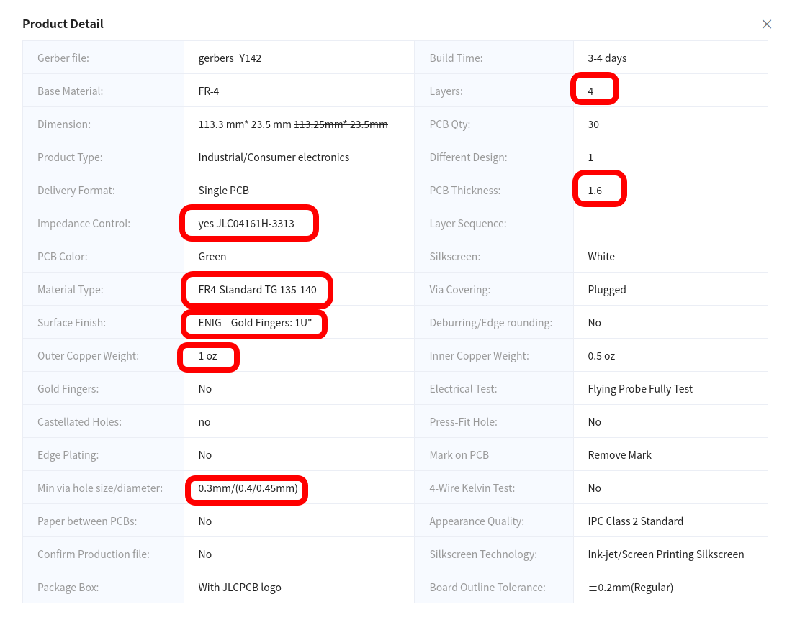

# TinyRiser
Cooler/cuter riser for Lenovo 8th/9th gen Tiny5 PCs

Exposes the x8 and x4 PCIe links in the riser slot, in the form of a PCIe x16 slot and an m.2 slot.

The x8 link comes from the CPU and was meant for GPU equipped models, while the x4 link comes from the PCH and was meant for the Thunderbolt and NIC equipped models. Lenovo made two different risers for these configurations, only using one link at a time, but this riser gives you both PCIe links at once! The two links are completely independent and are able to function at the same time.

Using this riser, you can install a low profile PCIe card just as you can with the stock risers, and add an extra M.2 NVMe SSD in addition to the onboard ones. The SSD is tucked away near the front of the machine, plugged into a right angle M-key M.2 slot that holds the SSD firmly in place. Due to an unfortunate non-removable standoff placement on the motherboard, only 2230, 2242 and 2260 size SSDs fit comfortably. It is possible to get a 2280 drive to fit if you try hard enough, but the fit will be suboptimal.

Doesn't require any modifications to the motherboard, just works plug and play (no bifurcation/lane reversal).

I've successfully tested this riser on my own M720q where it works 100% perfectly with x1, x4, x8 and x16 cards, and it will work just as well on the other machines that share this motherboard, the M920q, M920x and P330 Tiny.

Note that the M.2 slot only supports PCIe NVMe M-key or B+M-key drives, not SATA ones.

The v2 design includes a fan header that can be used in multiple ways:

- 12V no PWM
- 12V with PWM
- Voltage controlled speed

The last 2 modes require some kind of fan controller module plugged into the provided header. This has not been designed yet, but the possibility exists.

> Front side render of the PCB. I don't have a 3D model for the m.2 slot but you can see the footprint for it

> Back side render of the PCB.

> Front of it but in real life

> Back of it but also in real life

Compatible with M720q, M920q, M920x and P330 Tiny, as well as the NEC rebranded versions of those.  
**Don't stick it in an M910x or P320 Tiny, it will physically fit but the pinout is not compatible.**

Currently in version 2.1

## Parts list:
| part                | model                | link                                                                                     |
|---------------------|----------------------|------------------------------------------------------------------------------------------|
| PCIe slot           | UMAX 3183-10203P1T   | https://www.lcsc.com/product-detail/Card-Edge-Connectors_UMAX-3183-10203P1T_C404116.html |
| Vertical M-key slot | Lotes APCI0110-P001A | (available on aliexpress)                                                                |
| Screwpost           | YIYUAN SMTSOM340BTR  | https://www.lcsc.com/product-detail/Other-nuts_YIYUAN-SMTSOM340BTR_C5301786.html         |

## JLC PCB ordering details:

Please use the files from the v2 release, the main repo might be in the middle of version changes

> Screenshot of the JLC PCB order settings used for TinyRiser

https://github.com/a-little-wifi/Tinyriser/assets/139929586/086969f3-38e6-4d3a-b0c4-e65df9add474  
> unmute it

# Attribution
If you distribute this design or use this design to create a derivative design, you must keep attribution to this original design, in addition to following the terms in the license
